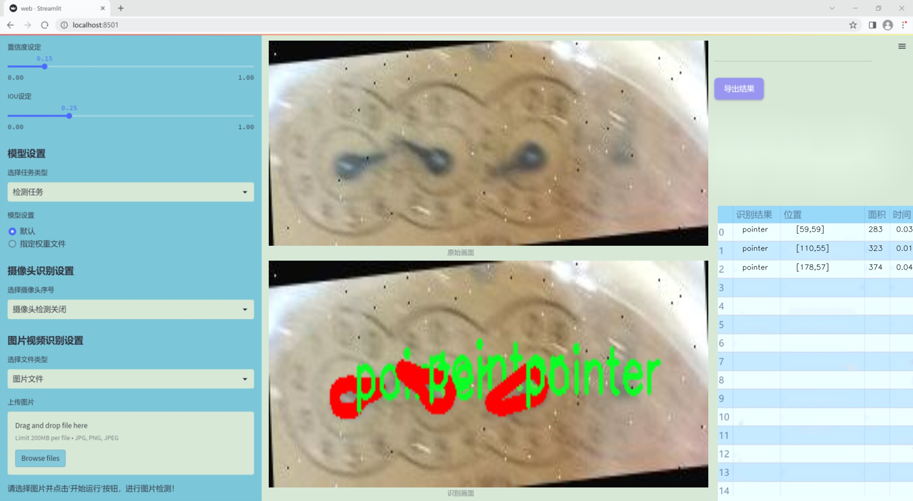
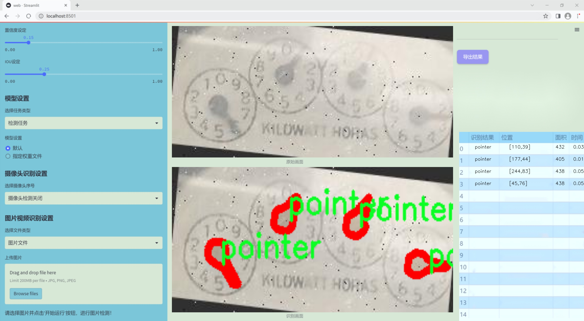
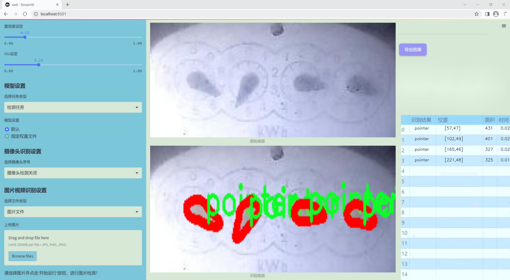
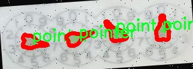
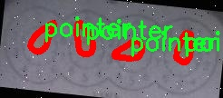

### 1.背景意义

研究背景与意义

随着智能设备的普及和自动化技术的快速发展，表盘指针的检测与识别在工业自动化、智能家居和车载系统等领域中变得愈发重要。表盘指针作为信息传递的一种重要方式，其准确检测直接关系到设备的性能和用户体验。传统的指针检测方法多依赖于图像处理技术，然而这些方法在复杂环境下的鲁棒性和准确性往往不足。因此，基于深度学习的目标检测技术，尤其是YOLO（You Only Look Once）系列模型，因其高效性和实时性，成为了研究的热点。

本研究旨在基于改进的YOLOv11模型，构建一个高效的表盘指针检测系统。该系统将利用一个包含3700张图像的数据集，专注于单一类别“pointer”的实例分割任务。通过对数据集的精细标注和多样化增强处理，模型将能够在不同的光照、角度和背景条件下，准确识别和定位表盘指针。这一研究不仅有助于提升指针检测的准确性和实时性，还能为相关领域的应用提供理论支持和技术基础。

在数据集的构建过程中，采用了多种数据增强技术，如随机旋转、亮度和曝光调整等，以增加模型的泛化能力。这些预处理和增强措施将有效提升模型在实际应用中的表现，使其能够适应多变的环境和条件。此外，改进YOLOv11模型的引入，将为指针检测任务提供更为先进的技术手段，推动计算机视觉领域的进一步发展。

综上所述，基于改进YOLOv11的表盘指针检测系统的研究，不仅具有重要的理论意义，还具备广泛的应用前景，能够为智能设备的自动化和智能化提供强有力的技术支持。

### 2.视频效果

[2.1 视频效果](https://www.bilibili.com/video/BV1C4qzYEEgH/)

### 3.图片效果







##### [项目涉及的源码数据来源链接](https://kdocs.cn/l/cszuIiCKVNis)**

注意：本项目提供训练的数据集和训练教程,由于版本持续更新,暂不提供权重文件（best.pt）,请按照6.训练教程进行训练后实现上图演示的效果。

### 4.数据集信息

##### 4.1 本项目数据集类别数＆类别名

nc: 1
names: ['pointer']


该项目为【图像分割】数据集，请在【训练教程和Web端加载模型教程（第三步）】这一步的时候按照【图像分割】部分的教程来训练

##### 4.2 本项目数据集信息介绍

本项目数据集信息介绍

本项目旨在改进YOLOv11的表盘指针检测系统，所使用的数据集“det_ponteiros_seg”专注于表盘指针的检测与识别。该数据集的设计考虑到了表盘指针在不同环境和条件下的多样性，以确保训练出的模型具备良好的泛化能力和准确性。数据集中包含的类别数量为1，主要针对“pointer”这一类别进行深入研究与分析。通过集中关注这一特定类别，数据集能够为模型提供更为精确的特征学习，从而提升指针检测的性能。

在数据集的构建过程中，收集了大量包含表盘指针的图像，这些图像涵盖了多种表盘类型、不同的指针样式以及多样的背景环境。这种多样性不仅增强了数据集的代表性，还为模型提供了丰富的训练样本，帮助其在实际应用中更好地应对各种复杂场景。此外，数据集中的图像经过精心标注，确保每个指针的位置和形状都得到了准确的识别。这种高质量的标注为模型的训练提供了坚实的基础，使其能够有效学习到指针的特征。

在数据预处理阶段，数据集还进行了图像增强处理，以模拟不同的光照条件、视角变化和噪声干扰，从而进一步提高模型的鲁棒性。通过这些措施，数据集不仅为YOLOv11的训练提供了丰富的样本，也为后续的模型评估和优化奠定了良好的基础。总之，数据集“det_ponteiros_seg”在表盘指针检测任务中发挥着至关重要的作用，为实现高效、准确的指针检测系统提供了强有力的支持。







### 5.全套项目环境部署视频教程（零基础手把手教学）

[5.1 所需软件PyCharm和Anaconda安装教程（第一步）](https://www.bilibili.com/video/BV1BoC1YCEKi/?spm_id_from=333.999.0.0&vd_source=bc9aec86d164b67a7004b996143742dc)


[5.2 安装Python虚拟环境创建和依赖库安装视频教程（第二步）](https://www.bilibili.com/video/BV1ZoC1YCEBw?spm_id_from=333.788.videopod.sections&vd_source=bc9aec86d164b67a7004b996143742dc)

### 6.改进YOLOv11训练教程和Web_UI前端加载模型教程（零基础手把手教学）

[6.1 改进YOLOv11训练教程和Web_UI前端加载模型教程（第三步）](https://www.bilibili.com/video/BV1BoC1YCEhR?spm_id_from=333.788.videopod.sections&vd_source=bc9aec86d164b67a7004b996143742dc)


按照上面的训练视频教程链接加载项目提供的数据集，运行train.py即可开始训练



     Epoch   gpu_mem       box       obj       cls    labels  img_size
     1/200     20.8G   0.01576   0.01955  0.007536        22      1280: 100%|██████████| 849/849 [14:42<00:00,  1.04s/it]
               Class     Images     Labels          P          R     mAP@.5 mAP@.5:.95: 100%|██████████| 213/213 [01:14<00:00,  2.87it/s]
                 all       3395      17314      0.994      0.957      0.0957      0.0843

     Epoch   gpu_mem       box       obj       cls    labels  img_size
     2/200     20.8G   0.01578   0.01923  0.007006        22      1280: 100%|██████████| 849/849 [14:44<00:00,  1.04s/it]
               Class     Images     Labels          P          R     mAP@.5 mAP@.5:.95: 100%|██████████| 213/213 [01:12<00:00,  2.95it/s]
                 all       3395      17314      0.996      0.956      0.0957      0.0845

     Epoch   gpu_mem       box       obj       cls    labels  img_size
     3/200     20.8G   0.01561    0.0191  0.006895        27      1280: 100%|██████████| 849/849 [10:56<00:00,  1.29it/s]
               Class     Images     Labels          P          R     mAP@.5 mAP@.5:.95: 100%|███████   | 187/213 [00:52<00:00,  4.04it/s]
                 all       3395      17314      0.996      0.957      0.0957      0.0845


###### [项目数据集下载链接](https://kdocs.cn/l/cszuIiCKVNis)

### 7.原始YOLOv11算法讲解


##### YOLO11介绍

Ultralytics YOLO11是一款尖端的、最先进的模型，它在之前YOLO版本成功的基础上进行了构建，并引入了新功能和改进，以进一步提升性能和灵活性。
**YOLO11设计快速、准确且易于使用，使其成为各种物体检测和跟踪、实例分割、图像分类以及姿态估计任务的绝佳选择。**


**结构图如下：**


##### **C3k2**

**C3k2，结构图如下**


**C3k2，继承自类`C2f，其中通过c3k设置False或者Ture来决定选择使用C3k还是`**Bottleneck


**实现代码** **ultralytics/nn/modules/block.py**

##### C2PSA介绍

**借鉴V10 PSA结构，实现了C2PSA和C2fPSA，最终选择了基于C2的C2PSA（可能涨点更好？）**


**实现代码** **ultralytics/nn/modules/block.py**

##### Detect介绍

**分类检测头引入了DWConv（更加轻量级，为后续二次创新提供了改进点），结构图如下（和V8的区别）：**


### 8.200+种全套改进YOLOV11创新点原理讲解

#### 8.1 200+种全套改进YOLOV11创新点原理讲解大全

由于篇幅限制，每个创新点的具体原理讲解就不全部展开，具体见下列网址中的改进模块对应项目的技术原理博客网址【Blog】（创新点均为模块化搭建，原理适配YOLOv5~YOLOv11等各种版本）

[改进模块技术原理博客【Blog】网址链接](https://gitee.com/qunmasj/good)


#### 8.2 精选部分改进YOLOV11创新点原理讲解

###### 这里节选部分改进创新点展开原理讲解(完整的改进原理见上图和[改进模块技术原理博客链接](https://gitee.com/qunmasj/good)【如果此小节的图加载失败可以通过CSDN或者Github搜索该博客的标题访问原始博客，原始博客图片显示正常】
### 可变性卷积DCN简介
卷积神经网络由于其构建模块中固定的几何结构，本质上受限于模型几何变换。为了提高卷积神经网络的转换建模能力，《Deformable Convolutional Networks》作者提出了两个模块：可变形卷积（deformable convolution）和可变形RoI池（deformable RoI pooling）。这两个模块均基于用额外的偏移来增加模块中的空间采样位置以及从目标任务中学习偏移的思想，而不需要额外的监督。

第一次证明了在深度神经网络中学习密集空间变换（dense spatial transformation）对于复杂的视觉任务是有效的

视觉识别中的一个关键挑战是如何适应对象比例、姿态、视点和零件变形中的几何变化或模型几何变换。一般有两种方法实现：
1）建立具有足够期望变化的训练数据集。这通常通过增加现有的数据样本来实现，例如通过仿射变换。但是训练成本昂贵而且模型参数庞大。
2）使用变换不变（transformation-invariant）的特征和算法。比如比较有名的SIFT(尺度不变特征变换)便是这一类的代表算法。

但以上的方法有两个缺点：
1）几何变换被假定为固定的和已知的，这些先验知识被用来扩充数据，设计特征和算法。为此，这个假设阻止了对具有未知几何变换的新任务的推广，从而导致这些几何变换可能没有被正确建模。
2）对于不变特征和算法进行手动设计，对于过于复杂的变换可能是困难的或不可行的。

卷积神经网络本质上局限于模拟大型未知转换。局限性源于CNN模块的固定几何结构：卷积单元在固定位置对输入特征图进行采样；池化层以固定比率降低特征矩阵分辨率；RoI（感兴趣区域）池化层将RoI分成固定的空间箱（spatial bins）等。缺乏处理几何变换的内部机制。

这种内部机制的缺乏会导致一些问题，举个例子。同一个CNN层中所有激活单元的感受野大小是相同的，但是这是不可取的。因为不同的位置可能对应于具有不同尺度或变形的对象，所以尺度或感受野大小的自适应确定对于具有精细定位的视觉识别是渴望的。

对于这些问题，作者提出了两个模块提高CNNs对几何变换建模的能力。


deformable convolution（可变形卷积）
将2D偏移量添加到标准卷积中的常规网格采样位置，使得采样网格能够自由变形。通过额外的卷积层，从前面的特征映射中学习偏移。因此，变形采用局部、密集和自适应的方式取决于输入特征。


deformable RoI pooling（可变形RoI池化）
为先前RoI池化的常规库（bin）分区中的每个库位置（bin partition）增加了一个偏移量。类似地，偏移是从前面的特征图和感兴趣区域中学习的，从而能够对具有不同形状的对象进行自适应部件定位（adaptive part localization）。

#### Deformable Convolutional Networks
Deformable Convolution
2D卷积由两个步骤组成：
1）在输入特征图x xx上使用规则网格R RR进行采样。
2）把这些采样点乘不同权重w ww后相加。

网格R定义感受野大小和扩张程度，比如内核大小为3x3，扩张程度为1的网格R可以表示为：
R = { ( − 1 , − 1 ) , ( − 1 , 0 ) , … , ( 0 , 1 ) , ( 1 , 1 ) } R = \{(-1,-1),(-1,0),\dots,(0,1),(1,1)\}
R={(−1,−1),(−1,0),…,(0,1),(1,1)}

​
 一般为小数，使用双线性插值进行处理。（把小数坐标分解到相邻的四个整数坐标点来计算结果）


具体操作如图所示：


首先对输入特征层进行一个普通的3x3卷积处理得到偏移域（offset field）。偏移域特征图具有与输入特征图相同的空间分辨率，channels维度2N对应于N个2D（xy两个方向）偏移。其中的N是原输入特征图上所具有的N个channels，也就是输入输出channels保持不变，这里xy两个channels分别对输出特征图上的一个channels进行偏移。确定采样点后就通过与相对应的权重w点乘相加得到输出特征图上该点最终值。

前面也提到过，由于这里xy两个方向所训练出来的偏移量一般来说是一个小数，那么为了得到这个点所对应的数值，会采用双线性插值的方法，从最近的四个邻近坐标点中计算得到该偏移点的数值，公式如下：


具体推理过程见：双线性插值原理

#### Deformable RoI Poolingb
所有基于区域提议（RPN）的对象检测方法都使用RoI池话处理，将任意大小的输入矩形区域转换为固定大小的特征图。


 一般为小数，需要使用双线性插值进行处理。


具体操作如图所示：


当时看这个部分的时候觉得有些突兀，明明RoI池化会将特征层转化为固定尺寸的区域。其实，我个人觉得，这个部分与上述的可变性卷积操作是类似的。这里同样是使用了一个普通的RoI池化操作，进行一些列处理后得到了一个偏移域特征图，然后重新作用于原来的w × H w \times Hw×H的RoI。只不过这里不再是规律的逐行逐列对每个格子进行池化，而是对于格子进行偏移后再池化处理。

#### Postion﹣Sensitive RoI Pooling
除此之外，论文还提出一种PS RoI池化（Postion﹣Sensitive RoI Pooling）。不同于上述可变形RoI池化中的全连接过程，这里使用全卷积替换。

具体操作如图所示：


首先，对于原来的特征图来说，原本是将输入特征图上的RoI区域分成k × k k\times kk×k个bin。而在这里，则是将输入特征图进行卷积操作，分别得到一个channels为k 2 ( C + 1 ) k^{2}(C+1)k (C+1)的得分图（score maps）和一个channels为2 k 2 ( C + 1 ) 2k{2}(C+1)2k 2 (C+1)的偏移域（offset fields），这两个特征矩阵的宽高是与输入特征矩阵相同的。其中，得分图的channels中，k × k k \times kk×k分别表示的是每一个网格，C CC表示的检测对象的类别数目，1表示背景。而在偏移域中的2表示xy两个方向的偏移。
也就是说，在PS RoI池化中，对于RoI的每一个网格都独自占一个通道形成一层得分图，然后其对于的偏移量占两个通道。offset fields得到的偏移是归一化后的偏移，需要通过和deformable RoI pooling中一样的变换方式得到∆ p i j ∆p_{ij}∆p ij，然后对每层得分图进行偏移池化处理。最后处理完的结果就对应着最后输出的一个网格。所以其包含了位置信息。

原文论述为：


#### Understanding Deformable ConvNets
当可变形卷积叠加时，复合变形的效果是深远的。如图所示：


ps：a是标准卷积的固定感受野，b是可变形卷积的适应性感受野。

感受野和标准卷积中的采样位置在整个顶部特征图上是固定的(左)。在可变形卷积中，它们根据对象的比例和形状进行自适应调整(右)。


### 9.系统功能展示

图9.1.系统支持检测结果表格显示

  图9.2.系统支持置信度和IOU阈值手动调节

  图9.3.系统支持自定义加载权重文件best.pt(需要你通过步骤5中训练获得)

  图9.4.系统支持摄像头实时识别

  图9.5.系统支持图片识别

  图9.6.系统支持视频识别

  图9.7.系统支持识别结果文件自动保存

  图9.8.系统支持Excel导出检测结果数据


### 10. YOLOv11核心改进源码讲解

#### 10.1 block.py

以下是对您提供的代码的核心部分进行的分析和详细注释：

```python
import torch
import torch.nn as nn
import torch.nn.functional as F

def autopad(k, p=None, d=1):
    """自动填充以保持输出形状相同。"""
    if d > 1:
        k = d * (k - 1) + 1 if isinstance(k, int) else [d * (x - 1) + 1 for x in k]  # 实际的卷积核大小
    if p is None:
        p = k // 2 if isinstance(k, int) else [x // 2 for x in k]  # 自动填充
    return p

class swish(nn.Module):
    """Swish激活函数的实现。"""
    def forward(self, x):
        return x * torch.sigmoid(x)

class DyReLU(nn.Module):
    """动态ReLU激活函数。"""
    def __init__(self, inp, reduction=4, lambda_a=1.0, use_bias=True):
        super(DyReLU, self).__init__()
        self.oup = inp
        self.lambda_a = lambda_a * 2
        self.avg_pool = nn.AdaptiveAvgPool2d(1)

        squeeze = inp // reduction
        self.fc = nn.Sequential(
            nn.Linear(inp, squeeze),
            nn.ReLU(inplace=True),
            nn.Linear(squeeze, self.oup * 2),  # 输出两个通道
            h_sigmoid()
        )

    def forward(self, x):
        """前向传播。"""
        b, c, h, w = x.size()
        y = self.avg_pool(x).view(b, c)  # 全局平均池化
        y = self.fc(y).view(b, self.oup * 2, 1, 1)  # 通过全连接层
        a1, b1 = torch.split(y, self.oup, dim=1)  # 分割为两个通道
        out = x * (a1 - 0.5) * self.lambda_a + b1  # 动态调整输出
        return out

class DyHeadBlock(nn.Module):
    """动态头块，包含多种注意力机制。"""
    def __init__(self, in_channels, norm_type='GN'):
        super().__init__()
        self.spatial_conv = DyDCNv2(in_channels, in_channels)  # 动态卷积
        self.scale_attn_module = nn.Sequential(
            nn.AdaptiveAvgPool2d(1), 
            nn.Conv2d(in_channels, 1, 1),
            nn.ReLU(inplace=True)
        )
        self.task_attn_module = DyReLU(in_channels)

    def forward(self, x):
        """前向传播。"""
        mid_feat = self.spatial_conv(x)  # 计算中间特征
        sum_feat = mid_feat * self.scale_attn_module(mid_feat)  # 计算加权特征
        return self.task_attn_module(sum_feat)  # 返回最终特征

class Fusion(nn.Module):
    """融合模块，支持多种融合方式。"""
    def __init__(self, inc_list, fusion='bifpn'):
        super().__init__()
        self.fusion = fusion
        self.fusion_conv = nn.ModuleList([Conv(inc, inc, 1) for inc in inc_list])  # 融合卷积

    def forward(self, x):
        """前向传播。"""
        if self.fusion == 'weight':
            return torch.sum(torch.stack(x, dim=0), dim=0)  # 权重融合
        elif self.fusion == 'concat':
            return torch.cat(x, dim=1)  # 连接融合
        elif self.fusion == 'bifpn':
            fusion_weight = nn.ReLU()(self.fusion_weight.clone())  # 计算融合权重
            return torch.sum(torch.stack([fusion_weight[i] * x[i] for i in range(len(x))], dim=0), dim=0)

class C3k_Faster(C3k):
    """快速C3块，使用更高效的卷积。"""
    def __init__(self, c1, c2, n=1):
        super().__init__(c1, c2, n)
        self.m = nn.Sequential(*(Faster_Block(c_, c_) for _ in range(n)))  # 多个快速块

class C3k2_Faster(C3k2):
    """快速C3k2块。"""
    def __init__(self, c1, c2, n=1):
        super().__init__(c1, c2, n)
        self.m = nn.ModuleList(C3k_Faster(self.c, self.c, 2) for _ in range(n))  # 多个快速块

# 其他类和模块的定义省略...

```

### 代码分析与注释
1. **autopad**: 用于自动计算卷积操作的填充，以确保输出尺寸与输入相同。
2. **swish**: 实现Swish激活函数，常用于深度学习模型中。
3. **DyReLU**: 动态ReLU激活函数，根据输入的平均值动态调整输出。
4. **DyHeadBlock**: 这是一个复杂的模块，包含动态卷积和多种注意力机制，用于特征提取。
5. **Fusion**: 融合模块，支持多种融合策略（加权、连接等），用于整合来自不同来源的特征。
6. **C3k_Faster**: 这是一个快速的C3块，使用更高效的卷积操作来提高计算效率。

### 结论
以上是对代码中核心部分的提炼和详细注释。每个模块都有其特定的功能和目的，整体结构设计用于提高深度学习模型的性能和效率。

该文件 `block.py` 是一个用于构建深度学习模型的模块，主要基于 PyTorch 框架。它包含了多个神经网络层和模块的定义，旨在实现高效的特征提取和融合。以下是对文件中主要内容的逐步分析和说明。

首先，文件引入了许多必要的库，包括 PyTorch、NumPy、以及一些自定义模块。这些模块提供了各种卷积、注意力机制和其他神经网络层的实现。

接下来，文件定义了一些基础的卷积和激活函数，如 `autopad` 函数用于自动计算卷积的填充，确保输出尺寸与输入相同。`swish`、`h_swish` 和 `h_sigmoid` 是几种不同的激活函数的实现。

在注意力机制方面，文件中定义了多个类，例如 `DyHeadBlock` 和 `DyHeadBlockWithDCNV3`，这些类实现了动态头部块，结合了可调节的卷积和注意力机制。`Fusion` 类则实现了特征融合的不同策略，如加权、适应性融合和拼接。

此外，文件中还实现了多种卷积模块，如 `C3k` 和 `C3k2`，这些模块通常用于构建更复杂的网络结构。它们的设计允许在特征图上进行多种操作，如卷积、池化和残差连接。

`FocalModulation` 和 `DynamicConv` 等类实现了更复杂的操作，旨在通过动态调整卷积核的权重来提高模型的表现。`SDFM` 和 `GEFM` 则是用于特征融合的模块，旨在结合不同来源的特征以提高模型的准确性。

在网络结构方面，文件中还定义了 `CSPStage` 和 `CSP_MSCB` 等类，这些类实现了 CSP（Cross Stage Partial）结构，能够有效地减少参数数量并提高计算效率。

最后，文件还实现了一些特定于任务的模块，如 `C3k2_PoolingFormer` 和 `C3k2_ConvFormer`，这些模块结合了卷积和自注意力机制，旨在提高模型在特定任务上的表现。

总的来说，`block.py` 文件提供了一个灵活且高效的基础，用于构建各种深度学习模型，特别是在计算机视觉领域。它通过组合不同的卷积、注意力机制和特征融合策略，旨在提高模型的性能和适应性。

#### 10.2 afpn.py

以下是保留的核心代码部分，并添加了详细的中文注释：

```python
import torch
import torch.nn as nn
import torch.nn.functional as F
from ..modules.conv import Conv

class BasicBlock(nn.Module):
    """基本的残差块，包含两个卷积层和跳跃连接"""
    def __init__(self, filter_in, filter_out):
        super(BasicBlock, self).__init__()
        # 第一个卷积层，使用3x3卷积
        self.conv1 = Conv(filter_in, filter_out, 3)
        # 第二个卷积层，使用3x3卷积，不使用激活函数
        self.conv2 = Conv(filter_out, filter_out, 3, act=False)

    def forward(self, x):
        residual = x  # 保存输入以便进行跳跃连接
        out = self.conv1(x)  # 通过第一个卷积层
        out = self.conv2(out)  # 通过第二个卷积层
        out += residual  # 添加跳跃连接
        return self.conv1.act(out)  # 返回经过激活函数处理的输出


class ASFF_2(nn.Module):
    """自适应特征融合模块，处理两个输入特征图"""
    def __init__(self, inter_dim=512):
        super(ASFF_2, self).__init__()
        self.inter_dim = inter_dim
        compress_c = 8  # 压缩通道数

        # 为每个输入特征图生成权重
        self.weight_level_1 = Conv(self.inter_dim, compress_c, 1)
        self.weight_level_2 = Conv(self.inter_dim, compress_c, 1)
        # 合并权重并生成最终权重
        self.weight_levels = nn.Conv2d(compress_c * 2, 2, kernel_size=1, stride=1, padding=0)
        self.conv = Conv(self.inter_dim, self.inter_dim, 3)  # 最后的卷积层

    def forward(self, input1, input2):
        # 计算每个输入的权重
        level_1_weight_v = self.weight_level_1(input1)
        level_2_weight_v = self.weight_level_2(input2)

        # 合并权重并计算最终权重
        levels_weight_v = torch.cat((level_1_weight_v, level_2_weight_v), 1)
        levels_weight = self.weight_levels(levels_weight_v)
        levels_weight = F.softmax(levels_weight, dim=1)  # 归一化权重

        # 融合输入特征图
        fused_out_reduced = input1 * levels_weight[:, 0:1, :, :] + \
                            input2 * levels_weight[:, 1:2, :, :]

        out = self.conv(fused_out_reduced)  # 通过卷积层
        return out


class BlockBody_P345(nn.Module):
    """处理三个尺度的特征图的主体模块"""
    def __init__(self, channels=[64, 128, 256, 512]):
        super(BlockBody_P345, self).__init__()

        # 定义不同尺度的卷积块
        self.blocks_scalezero1 = nn.Sequential(Conv(channels[0], channels[0], 1))
        self.blocks_scaleone1 = nn.Sequential(Conv(channels[1], channels[1], 1))
        self.blocks_scaletwo1 = nn.Sequential(Conv(channels[2], channels[2], 1))

        # 定义下采样和上采样模块
        self.downsample_scalezero1_2 = Downsample_x2(channels[0], channels[1])
        self.upsample_scaleone1_2 = Upsample(channels[1], channels[0], scale_factor=2)

        # 定义自适应特征融合模块
        self.asff_scalezero1 = ASFF_2(inter_dim=channels[0])
        self.asff_scaleone1 = ASFF_2(inter_dim=channels[1])

    def forward(self, x):
        x0, x1, x2 = x  # 输入特征图

        # 通过卷积块处理输入特征图
        x0 = self.blocks_scalezero1(x0)
        x1 = self.blocks_scaleone1(x1)
        x2 = self.blocks_scaletwo1(x2)

        # 进行特征融合
        scalezero = self.asff_scalezero1(x0, self.upsample_scaleone1_2(x1))
        scaleone = self.asff_scaleone1(self.downsample_scalezero1_2(x0), x1)

        return scalezero, scaleone  # 返回融合后的特征图


class AFPN_P345(nn.Module):
    """自适应特征金字塔网络（AFPN）"""
    def __init__(self, in_channels=[256, 512, 1024], out_channels=256, factor=4):
        super(AFPN_P345, self).__init__()

        # 初始化卷积层以调整输入通道数
        self.conv0 = Conv(in_channels[0], in_channels[0] // factor, 1)
        self.conv1 = Conv(in_channels[1], in_channels[1] // factor, 1)
        self.conv2 = Conv(in_channels[2], in_channels[2] // factor, 1)

        # 定义主体部分
        self.body = BlockBody_P345([in_channels[0] // factor, in_channels[1] // factor, in_channels[2] // factor])

        # 输出卷积层
        self.conv00 = Conv(in_channels[0] // factor, out_channels, 1)
        self.conv11 = Conv(in_channels[1] // factor, out_channels, 1)
        self.conv22 = Conv(in_channels[2] // factor, out_channels, 1)

    def forward(self, x):
        x0, x1, x2 = x  # 输入特征图

        # 通过卷积层调整特征图
        x0 = self.conv0(x0)
        x1 = self.conv1(x1)
        x2 = self.conv2(x2)

        # 通过主体处理特征图
        out0, out1, out2 = self.body([x0, x1, x2])

        # 通过输出卷积层
        out0 = self.conv00(out0)
        out1 = self.conv11(out1)
        out2 = self.conv22(out2)
        return [out0, out1, out2]  # 返回处理后的特征图
```

### 代码说明
1. **BasicBlock**: 这是一个基本的残差块，包含两个卷积层和一个跳跃连接，帮助模型学习更深层次的特征。
2. **ASFF_2**: 自适应特征融合模块，处理两个输入特征图，通过计算权重并融合输入特征图，增强特征表示。
3. **BlockBody_P345**: 处理三个尺度特征图的主体模块，包含卷积层、下采样、上采样和自适应特征融合。
4. **AFPN_P345**: 自适应特征金字塔网络，负责输入特征图的处理和输出特征图的生成。

这个程序文件`afpn.py`实现了一种特征金字塔网络（FPN）的结构，主要用于计算机视觉任务，特别是目标检测和分割。该网络的设计允许在不同的尺度上进行特征融合，以提高模型对多尺度目标的检测能力。

首先，文件中导入了一些必要的库，包括`torch`和`torch.nn`，以及一些自定义的模块，如`Conv`和不同的块（`C2f`, `C3`, `C3Ghost`, `C3k2`）。这些模块用于构建网络的基本单元。

接下来，定义了一些基本的网络组件，包括`BasicBlock`、`Upsample`、`Downsample_x2`、`Downsample_x4`、`Downsample_x8`等。`BasicBlock`类实现了一个包含两个卷积层的基本块，并通过残差连接来增强特征的传递。`Upsample`和`Downsample`类则实现了上采样和下采样操作，以便在不同的特征图之间进行尺度转换。

在特征融合方面，`ASFF_2`、`ASFF_3`和`ASFF_4`类实现了自适应特征融合模块（ASFF），这些模块通过学习不同尺度特征的权重来进行特征融合。每个ASFF模块根据输入特征图计算权重，并将不同尺度的特征进行加权求和，最后通过卷积层输出融合后的特征图。

`BlockBody_P345`和`BlockBody_P2345`类则定义了特定的网络结构，这些结构包含多个卷积块和ASFF模块，分别处理3个和4个尺度的特征。每个结构都包含了多层的卷积和下采样、上采样操作，以便在不同的特征尺度上进行处理。

`AFPN_P345`和`AFPN_P2345`类是网络的主要接口，负责初始化网络的输入和输出通道，并将特征图传递给相应的`BlockBody`进行处理。它们还包括了权重初始化的步骤，以确保网络的训练效果。

最后，`AFPN_P345_Custom`和`AFPN_P2345_Custom`类允许用户自定义块的类型，以便于实验不同的网络结构。

整体来看，这个程序文件通过模块化的设计，使得特征金字塔网络的构建变得灵活且易于扩展，适合于多种计算机视觉任务的应用。

#### 10.3 hcfnet.py

以下是代码中最核心的部分，并附上详细的中文注释：

```python
import torch
import torch.nn as nn
import torch.nn.functional as F

class SpatialAttentionModule(nn.Module):
    def __init__(self):
        super(SpatialAttentionModule, self).__init__()
        # 定义一个卷积层，用于生成空间注意力图
        self.conv2d = nn.Conv2d(in_channels=2, out_channels=1, kernel_size=7, stride=1, padding=3)
        self.sigmoid = nn.Sigmoid()  # 使用Sigmoid激活函数将输出限制在0到1之间

    def forward(self, x):
        # 计算输入特征图的平均值和最大值
        avgout = torch.mean(x, dim=1, keepdim=True)  # 沿通道维度计算平均值
        maxout, _ = torch.max(x, dim=1, keepdim=True)  # 沿通道维度计算最大值
        out = torch.cat([avgout, maxout], dim=1)  # 将平均值和最大值拼接在一起
        out = self.sigmoid(self.conv2d(out))  # 通过卷积层和Sigmoid激活函数生成注意力图
        return out * x  # 将注意力图与输入特征图相乘，得到加权后的特征图

class LocalGlobalAttention(nn.Module):
    def __init__(self, output_dim, patch_size):
        super().__init__()
        self.output_dim = output_dim
        self.patch_size = patch_size
        # 定义两个全连接层和一个卷积层
        self.mlp1 = nn.Linear(patch_size * patch_size, output_dim // 2)
        self.norm = nn.LayerNorm(output_dim // 2)
        self.mlp2 = nn.Linear(output_dim // 2, output_dim)
        self.conv = nn.Conv2d(output_dim, output_dim, kernel_size=1)
        # 定义可学习的参数
        self.prompt = torch.nn.parameter.Parameter(torch.randn(output_dim, requires_grad=True)) 
        self.top_down_transform = torch.nn.parameter.Parameter(torch.eye(output_dim), requires_grad=True)

    def forward(self, x):
        x = x.permute(0, 2, 3, 1)  # 调整输入的维度顺序
        B, H, W, C = x.shape  # 获取批量大小、高度、宽度和通道数
        P = self.patch_size

        # 提取局部特征
        local_patches = x.unfold(1, P, P).unfold(2, P, P)  # 提取局部patch
        local_patches = local_patches.reshape(B, -1, P * P, C)  # 重塑形状
        local_patches = local_patches.mean(dim=-1)  # 沿最后一个维度计算平均值

        # 通过全连接层和层归一化处理局部特征
        local_patches = self.mlp1(local_patches)  # (B, H/P*W/P, input_dim // 2)
        local_patches = self.norm(local_patches)  # (B, H/P*W/P, input_dim // 2)
        local_patches = self.mlp2(local_patches)  # (B, H/P*W/P, output_dim)

        local_attention = F.softmax(local_patches, dim=-1)  # 计算局部注意力
        local_out = local_patches * local_attention  # 加权局部特征

        # 计算与prompt的余弦相似度
        cos_sim = F.normalize(local_out, dim=-1) @ F.normalize(self.prompt[None, ..., None], dim=1)  # B, N, 1
        mask = cos_sim.clamp(0, 1)  # 限制相似度在0到1之间
        local_out = local_out * mask  # 应用mask
        local_out = local_out @ self.top_down_transform  # 进行变换

        # 恢复形状并进行上采样
        local_out = local_out.reshape(B, H // P, W // P, self.output_dim)  # (B, H/P, W/P, output_dim)
        local_out = local_out.permute(0, 3, 1, 2)  # 调整维度顺序
        local_out = F.interpolate(local_out, size=(H, W), mode='bilinear', align_corners=False)  # 上采样
        output = self.conv(local_out)  # 通过卷积层得到最终输出

        return output

class PPA(nn.Module):
    def __init__(self, in_features, filters) -> None:
        super().__init__()
        # 定义多个卷积层和注意力模块
        self.skip = nn.Conv2d(in_features, filters, kernel_size=1, stride=1)  # 跳跃连接
        self.c1 = nn.Conv2d(filters, filters, kernel_size=3, padding=1)
        self.c2 = nn.Conv2d(filters, filters, kernel_size=3, padding=1)
        self.c3 = nn.Conv2d(filters, filters, kernel_size=3, padding=1)
        self.sa = SpatialAttentionModule()  # 空间注意力模块
        self.lga2 = LocalGlobalAttention(filters, 2)  # 局部全局注意力模块
        self.lga4 = LocalGlobalAttention(filters, 4)  # 局部全局注意力模块
        self.bn1 = nn.BatchNorm2d(filters)  # 批归一化
        self.silu = nn.SiLU()  # SiLU激活函数

    def forward(self, x):
        x_skip = self.skip(x)  # 跳跃连接
        x_lga2 = self.lga2(x_skip)  # 局部全局注意力
        x_lga4 = self.lga4(x_skip)  # 局部全局注意力
        x1 = self.c1(x)  # 第一层卷积
        x2 = self.c2(x1)  # 第二层卷积
        x3 = self.c3(x2)  # 第三层卷积
        # 将所有特征图相加
        x = x1 + x2 + x3 + x_skip + x_lga2 + x_lga4
        x = self.sa(x)  # 应用空间注意力
        x = self.bn1(x)  # 批归一化
        x = self.silu(x)  # 激活
        return x  # 返回最终输出
```

以上代码主要实现了空间注意力模块、局部全局注意力模块和PPA模块。每个模块都有其特定的功能，通过组合使用这些模块，可以有效地提取和增强特征。

这个程序文件 `hcfnet.py` 实现了一种深度学习模型的组件，主要用于图像处理任务。文件中定义了多个类，每个类实现了特定的功能模块。

首先，`SpatialAttentionModule` 类实现了空间注意力机制。它通过计算输入特征图的平均值和最大值来生成注意力图，然后通过卷积层和 Sigmoid 激活函数对这些特征进行处理，最终将生成的注意力图与输入特征图相乘，以突出重要的空间信息。

接下来，`LocalGlobalAttention` 类结合了局部和全局注意力机制。它首先将输入特征图划分为多个小块，并对每个小块进行处理，提取局部特征。然后，利用多层感知机（MLP）对这些特征进行变换，并通过 Softmax 函数计算注意力权重。最后，将局部特征与全局特征结合，恢复特征图的形状，并通过卷积层进行进一步处理。

`ECA` 类实现了有效的通道注意力机制。它通过自适应平均池化将输入特征图压缩为一维向量，然后使用一维卷积来生成通道注意力权重，最后将这些权重应用于输入特征图，以增强重要通道的特征。

`PPA` 类是一个复合模块，结合了前面提到的空间注意力、局部全局注意力和通道注意力。它通过多个卷积层提取特征，并将不同的特征融合在一起，最终输出经过注意力机制处理的特征图。

`Bag` 类实现了一种简单的加权机制，用于结合不同来源的特征。它通过对输入特征进行加权求和，来生成最终的特征表示。

最后，`DASI` 类是一个更复杂的模块，结合了不同层次的特征。它通过多个卷积层和跳跃连接来处理高、中、低层特征，并利用 `Bag` 类来融合这些特征。最终输出经过归一化和激活函数处理的特征图。

整体来看，这个文件实现了一个多层次、多注意力机制的深度学习模型组件，旨在提高图像处理任务中的特征提取能力和模型性能。

#### 10.4 fadc.py

以下是提取出的核心部分代码，并附上详细的中文注释：

```python
import torch
import torch.nn as nn
import torch.nn.functional as F

class OmniAttention(nn.Module):
    def __init__(self, in_planes, out_planes, kernel_size, groups=1, reduction=0.0625, kernel_num=4, min_channel=16):
        super(OmniAttention, self).__init__()
        # 计算注意力通道数
        attention_channel = max(int(in_planes * reduction), min_channel)
        self.kernel_size = kernel_size
        self.kernel_num = kernel_num
        self.temperature = 1.0  # 温度参数，用于控制注意力的平滑程度

        # 定义平均池化层
        self.avgpool = nn.AdaptiveAvgPool2d(1)
        # 定义全连接层
        self.fc = nn.Conv2d(in_planes, attention_channel, 1, bias=False)
        self.bn = nn.BatchNorm2d(attention_channel)  # 批归一化
        self.relu = nn.ReLU(inplace=True)  # ReLU激活函数

        # 定义通道注意力
        self.channel_fc = nn.Conv2d(attention_channel, in_planes, 1, bias=True)
        self.func_channel = self.get_channel_attention

        # 定义滤波器注意力
        if in_planes == groups and in_planes == out_planes:  # 深度可分离卷积
            self.func_filter = self.skip
        else:
            self.filter_fc = nn.Conv2d(attention_channel, out_planes, 1, bias=True)
            self.func_filter = self.get_filter_attention

        # 定义空间注意力
        if kernel_size == 1:  # 点卷积
            self.func_spatial = self.skip
        else:
            self.spatial_fc = nn.Conv2d(attention_channel, kernel_size * kernel_size, 1, bias=True)
            self.func_spatial = self.get_spatial_attention

        # 定义核注意力
        if kernel_num == 1:
            self.func_kernel = self.skip
        else:
            self.kernel_fc = nn.Conv2d(attention_channel, kernel_num, 1, bias=True)
            self.func_kernel = self.get_kernel_attention

        self._initialize_weights()  # 初始化权重

    def _initialize_weights(self):
        # 初始化卷积层和批归一化层的权重
        for m in self.modules():
            if isinstance(m, nn.Conv2d):
                nn.init.kaiming_normal_(m.weight, mode='fan_out', nonlinearity='relu')
                if m.bias is not None:
                    nn.init.constant_(m.bias, 0)
            if isinstance(m, nn.BatchNorm2d):
                nn.init.constant_(m.weight, 1)
                nn.init.constant_(m.bias, 0)

    def get_channel_attention(self, x):
        # 计算通道注意力
        channel_attention = torch.sigmoid(self.channel_fc(x).view(x.size(0), -1, 1, 1) / self.temperature)
        return channel_attention

    def get_filter_attention(self, x):
        # 计算滤波器注意力
        filter_attention = torch.sigmoid(self.filter_fc(x).view(x.size(0), -1, 1, 1) / self.temperature)
        return filter_attention

    def get_spatial_attention(self, x):
        # 计算空间注意力
        spatial_attention = self.spatial_fc(x).view(x.size(0), 1, 1, 1, self.kernel_size, self.kernel_size)
        spatial_attention = torch.sigmoid(spatial_attention / self.temperature)
        return spatial_attention

    def get_kernel_attention(self, x):
        # 计算核注意力
        kernel_attention = self.kernel_fc(x).view(x.size(0), -1, 1, 1, 1, 1)
        kernel_attention = F.softmax(kernel_attention / self.temperature, dim=1)
        return kernel_attention

    def forward(self, x):
        # 前向传播
        x = self.avgpool(x)  # 平均池化
        x = self.fc(x)  # 全连接层
        x = self.bn(x)  # 批归一化
        x = self.relu(x)  # ReLU激活
        return self.func_channel(x), self.func_filter(x), self.func_spatial(x), self.func_kernel(x)  # 返回各类注意力

# 示例使用
# omni_attention = OmniAttention(in_planes=64, out_planes=128, kernel_size=3)
# output = omni_attention(input_tensor)
```

### 代码说明：
1. **OmniAttention类**：实现了一种全局注意力机制，能够根据输入的特征图生成通道、滤波器、空间和核的注意力。
2. **初始化方法**：定义了各个注意力的计算方式，并初始化权重。
3. **前向传播**：通过平均池化、全连接层、批归一化和激活函数处理输入，并计算不同类型的注意力。

该代码片段展示了如何通过注意力机制来增强特征图的表达能力，适用于图像处理和计算机视觉任务。

这个程序文件 `fadc.py` 是一个使用 PyTorch 实现的深度学习模块，主要包含了自适应膨胀卷积（Adaptive Dilated Convolution）和频率选择（Frequency Selection）等功能。以下是对文件中主要组件的详细说明。

首先，文件引入了必要的库，包括 PyTorch 和 NumPy，并尝试从 `mmcv` 库中导入一些特定的模块，如果导入失败，则使用默认的 `nn.Module` 作为替代。接下来，定义了一个名为 `OmniAttention` 的类，这个类实现了一种全局注意力机制。它的构造函数接受多个参数，包括输入和输出通道数、卷积核大小、组数、通道缩减比例等。该类的主要功能是通过自适应平均池化、全连接层和激活函数来计算通道注意力、过滤器注意力、空间注意力和卷积核注意力。

`OmniAttention` 类中还定义了一些辅助方法，如 `_initialize_weights` 用于初始化权重，`update_temperature` 用于更新温度参数，以及多个用于计算不同类型注意力的静态方法。`forward` 方法实现了前向传播过程，计算并返回不同的注意力值。

接下来，定义了一个名为 `generate_laplacian_pyramid` 的函数，该函数用于生成拉普拉斯金字塔。拉普拉斯金字塔是一种图像处理技术，用于提取图像的不同频率成分。该函数通过逐层下采样输入张量并计算高频成分来构建金字塔。

然后，定义了 `FrequencySelection` 类，该类实现了频率选择机制。构造函数接受多个参数，包括输入通道数、频率列表、低频注意力标志、特征选择类型等。该类的主要功能是根据输入特征生成频率选择的权重，并在前向传播中应用这些权重。根据不同的 `lp_type`，该类可以实现不同的频率选择策略，如平均池化、拉普拉斯金字塔或频域选择。

`AdaptiveDilatedConv` 类是一个自适应膨胀卷积的实现，继承自 `ModulatedDeformConv2d`。该类的构造函数接受多个参数，包括输入和输出通道数、卷积核大小、步幅、填充、膨胀因子等。它还支持频率选择和注意力机制的集成。该类的 `forward` 方法实现了自适应膨胀卷积的前向传播过程，结合了频率选择和注意力机制。

最后，`AdaptiveDilatedDWConv` 类是对 `AdaptiveDilatedConv` 的扩展，主要用于深度可分离卷积。它的构造函数和 `forward` 方法与 `AdaptiveDilatedConv` 类似，但增加了对正常卷积维度的支持。

整体来看，这个文件实现了一个复杂的卷积神经网络模块，结合了自适应卷积、注意力机制和频率选择等先进技术，适用于图像处理和计算机视觉任务。

### 11.完整训练+Web前端界面+200+种全套创新点源码、数据集获取


# [下载链接：https://mbd.pub/o/bread/Z5yZmZ5v](https://mbd.pub/o/bread/Z5yZmZ5v)